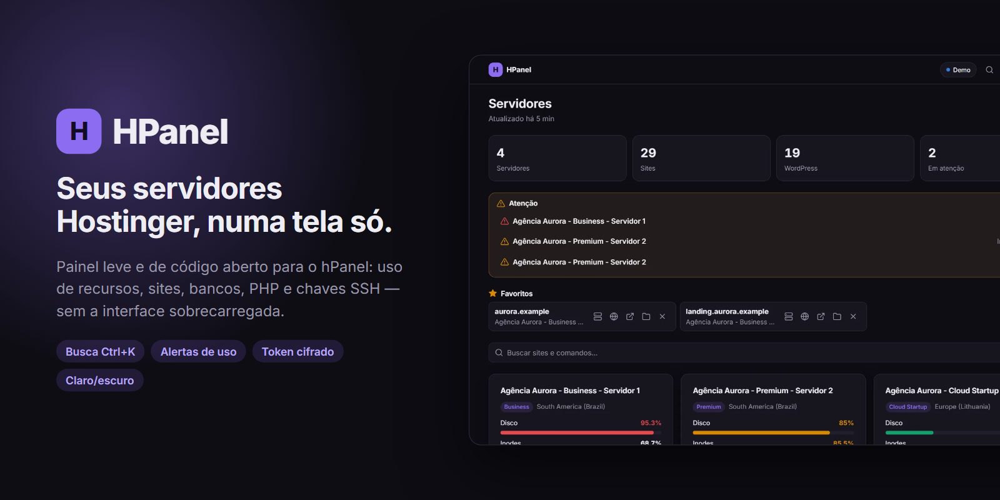
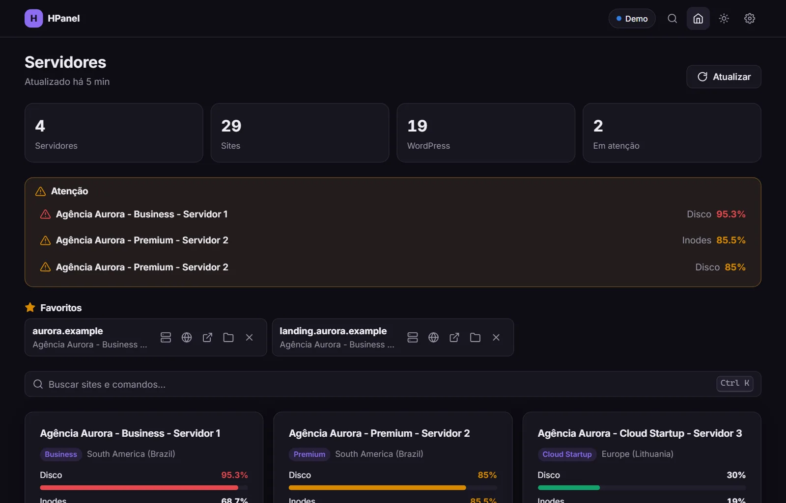

# HPanel

Painel para gerenciar todos os seus sites da Hostinger em um só lugar, sem navegar pelo hPanel a cada operação.


**Ver demonstração:** rode o painel localmente (veja [Instalação](#-instalação)) e clique em **Ver demonstração** na página inicial — tudo funciona com dados fictícios, sem conta na Hostinger.



### ✨ Funcionalidades

- **📊 Visão geral de servidores** - Todos os planos de hospedagem com estatísticas de uso
- **⚠️ Atenção** - Destaca servidores com disco ou inodes ≥ 80 % (≥ 90 % em vermelho)
- **⭐ Favoritos** - Fixe os sites que você mais usa no topo do dashboard
- **🔎 Busca Ctrl+K** - Paleta de busca rápida por sites e servidores em toda a conta
- **🌐 Websites** - Domínios, subdomínios e addons de cada servidor
- **📁 Gerenciador de Arquivos** - Link direto para cada domínio ou para a raiz da conta (botão no topo do servidor)
- **🗄️ Bancos de dados** - Lista bancos com acesso ao phpMyAdmin
- **🐘 Versão PHP** - Altere a versão PHP de qualquer domínio
- **🔑 Chave SSH (Git)** - Veja, crie ou recrie a chave SSH de deploy de cada servidor
- **🌿 Git e auto deploy** - Repositórios de cada domínio: criar, implantar na hora, ver a saída do último deploy, copiar o webhook e excluir
- **📈 Uso** - Disco, inodes, RAM, CPU; respostas em cache na aba (exibe na hora e atualiza em segundo plano)
- **📉 Gráficos de recursos** - CPU, memória, PHP workers, processos, I/O e IOPS em 1 h / 6 h / 24 h / 7 dias / 30 dias, com média, pico, limite do plano e marcação de quando o limite foi atingido
- **🛡️ Antimalware** - Status do Monarx na visão geral do servidor (protegido, arquivos suspeitos, último scan)
- **⏰ Cron jobs** - Aba própria em cada servidor: buscar, criar (script PHP ou comando), ver o resultado da última execução e excluir
- **⏱️ Sessão** - Indicador no cabeçalho com a validade do token; renovação automática e em 1 clique
- **🌓 Tema** - Claro, escuro ou seguir o sistema (em Configurações)

---

## 🧪 Modo demonstração

O botão **Ver demonstração** na página inicial abre o painel completo com dados fictícios (`lib/demo/fixtures.json`, domínios `.example`). Nenhuma chamada é feita à Hostinger e ações que alteram algo (versão PHP, chave SSH, Git, cron jobs) ficam indisponíveis. Para sair, use **Conectar sua conta** ou **Sair do demo**.

## ⌨️ Busca Ctrl+K

`Ctrl+K` (ou `⌘K`, ou `/` fora de campos de texto) abre a paleta de busca. Use `↑`/`↓` para navegar, `Enter` para abrir e `Esc` para fechar. Em um site, `Tab` mostra as ações rápidas — **Visitar**, **hPanel**, **Arquivos**, **Servidor** — escolhidas com `←`/`→`. Os itens abertos recentemente e os favoritos ficam salvos no navegador (só aparecem os da conta carregada); **Limpar favoritos e recentes** fica em Configurações.

## 🌿 Git e auto deploy

O botão de Git na lista de sites abre o gerenciador de repositórios **do domínio**. Como na Hostinger o Git é configurado por vhost, os subdomínios são gerenciados pelo domínio pai — por isso o botão só aparece nas linhas de domínio.

Dentro da modal dá para:

- **Criar** um repositório (URL, branch e diretório; em branco = `public_html`). A pasta de destino precisa estar vazia, e repositórios privados exigem a chave SSH do servidor cadastrada no GitHub/GitLab (aba **Ferramentas**).
- **Implantar** na hora (o mesmo `git pull` que o webhook dispara).
- Ver a **saída do último deploy**.
- **Copiar o webhook** de auto deploy — ele fica mascarado por padrão. Trate o token como senha: quem o tiver dispara um deploy nesse site.
- **Excluir** o repositório (os arquivos já publicados permanecem no servidor).

## ⏰ Cron jobs

Na Hostinger o cron é da **conta** (vale para todos os sites do servidor), por isso fica numa aba do servidor, não na lista de sites. A visão geral mostra quantas tarefas existem e leva direto para a aba.

- **Criar**: **Script PHP** (caminho a partir de `/home/<usuário>/`, executado com `/usr/bin/php`) ou **Comando personalizado** (qualquer comando de uma linha, como `wget -O /dev/null https://site.com/cron.php`). A frequência vem de um preset ou dos 5 campos (minuto, hora, dia, mês, dia da semana), com a descrição em português ao lado.
- **Resultado**: saída da última execução — útil para achar URLs que respondem erro 500 ou domínios que não resolvem mais.
- **Buscar** por comando ou horário quando há muitas tarefas, e **excluir** com confirmação.

A Hostinger não tem edição de tarefa: para mudar o horário ou o comando, crie a nova e exclua a antiga.

## ⭐ Favoritos

Clique na estrela de um site para fixá-lo na seção **Favoritos** do dashboard. A lista fica no `localStorage` do navegador (nada vai para o servidor).

## ⚠️ Atenção

A seção **Atenção** no dashboard lista os servidores com disco ou inodes a partir de 80 % de uso (aviso) e 90 % (crítico), os mais graves primeiro, com link para o servidor.

---

## 🔐 Autenticação

O dashboard usa o **token JWT** da sua própria sessão no hPanel. Você cola o token na página **Conectar** e ele passa a ficar só no servidor — o navegador nunca mais o vê.

- O token é **cifrado com AES-256-GCM** e gravado em `storage/sessions/`.
- A chave de cifragem é derivada do cookie `hp_sid` (HttpOnly) do seu navegador: **sem o seu navegador, o arquivo é ilegível**, mesmo para quem tiver acesso à pasta.
- **Sair** apaga o token do servidor de verdade (não apenas do navegador).
- Sessões paradas por **7 dias** são removidas automaticamente.

> ⚠️ O token JWT expira a cada **~1 hora**, mas é **renovado automaticamente pelo servidor** (veja abaixo). Só é preciso colá-lo de novo se ele expirar de vez.

---

## 📦 Instalação

### Requisitos

- PHP 8.1 ou superior, com as extensões `curl` e `openssl`
- Certificados de CA configurados no PHP (`curl.cainfo` no `php.ini`, apontando para um `cacert.pem`). Sem isso a conexão com a Hostinger falha com "A Hostinger não respondeu" e o log mostra `unable to get local issuer certificate`.
- Servidor web (Apache, Nginx, Laragon, XAMPP, etc.)

### Passos

1. **Clone os arquivos** no servidor:
```bash
git clone https://github.com/arismarioneves/HPanel.git
cd HPanel
```

2. **Configuração**: o `config.php` é criado sozinho no primeiro acesso (a pasta precisa de permissão de escrita). Se preferir, crie manualmente:
```bash
cp config.exemplo.php config.php
```
   - Ajuste `base` (ex.: `'/hpanel/'`) se o painel estiver em uma subpasta.
   - Recomendado: aponte `storage_dir` para uma pasta **fora** da pasta pública.

3. **Abra o painel** no navegador e clique em **Conectar** (ou **Ver demonstração**).

### Nginx

No Apache o `.htaccess` já bloqueia tudo que não é público. No Nginx, use o bloco equivalente (instalação na **raiz** do domínio, `base => '/'`):

```nginx
location ~ ^/(storage|lib|partials|tests|tools|vendor|docs)(/|$) { deny all; }
location ~ ^/(config(\.exemplo)?\.php|composer\.(json|lock)|package\.json|phpunit\.xml)$ { deny all; }
location ~ /\. { deny all; }
location / { try_files $uri $uri/ $uri.php?$query_string; }
```

Em **subpasta**, prefixe as regras com o mesmo caminho de `base`. Exemplo para `'base' => '/hpanel/'`:

```nginx
location ~ ^/hpanel/(storage|lib|partials|tests|tools|vendor|docs)(/|$) { deny all; }
location ~ ^/hpanel/(config(\.exemplo)?\.php|composer\.(json|lock)|package\.json|phpunit\.xml)$ { deny all; }
location ~ /\. { deny all; }
location /hpanel/ { try_files $uri $uri/ $uri.php?$query_string; }
```

### Desenvolvimento

```bash
composer install
vendor/bin/phpunit
node --test tests/js/        # requer Node 18+
php -S 127.0.0.1:8099 tools/dev-router.php
```

---

## ⚙️ Configuração do Token JWT

### Passo a passo

1. Acesse [hpanel.hostinger.com](https://hpanel.hostinger.com) e faça login
2. Abra o DevTools (`F12`)
3. Vá para **Application** → **Cookies** → **hpanel.hostinger.com**
4. Encontre o cookie chamado `jwt` e copie seu valor
5. Cole na página **Conectar** do painel (botão **Conectar** na página inicial) e salve

### Dica

O token começa com `eyJ` e é uma string longa. Exemplo:

```
eyJ0eXAiOiJKV1QiLCJhbGciOiJSUzI1NiJ9.eyJpYXQiOjE3Mzc...
```

---

## 🔑 Chave SSH (Git)

Na página de cada servidor há a seção **Chave SSH (Git)**, que gerencia a chave pública usada nos deploys via Git da conta:

- **Ver** - Exibe a chave pública atual (com botão de copiar)
- **Criar** - Gera o par de chaves quando a conta ainda não tem
- **Recriar** - Remove a chave atual e gera uma nova (a antiga deixa de funcionar)

> ⚠️ Nem todo servidor usa SSH para deploy — alguns usam GitHub App. Ao **criar** uma chave SSH, o próprio hPanel volta a exibir a interface de deploy via SSH para os sites daquela conta.

---

## 🔄 Renovação do Token

O JWT do hPanel usa **sessão deslizante**: enquanto ainda não expirou de vez, o endpoint `/auth/refresh` devolve um token novo válido por mais ~1h, usando apenas o próprio JWT.

- **Automática**: em qualquer chamada à API do dashboard, se faltam **≤ 15 min** para o token expirar, o **servidor** o renova antes de responder — sem cron e sem nada rodando no navegador.
- **Renovar agora**: botão na página de Configurações, útil depois de muito tempo sem usar.
- **Sair**: também em Configurações; apaga o token do servidor.

> ⚠️ Se o token **expirar de vez**, o refresh falha e é preciso **colar o JWT novamente** na página Conectar.

---

## 📁 Estrutura do Projeto

```
HPanel/
├── index.php            # Landing (sem sessão) ou dashboard: Atenção, Favoritos, servidores
├── connect.php          # Conectar: colar o token JWT
├── server.php           # Servidor em abas (visão geral, sites, bancos, cron jobs, ferramentas)
├── settings.php         # Configurações (sessão, renovar, sair, tema)
├── config.exemplo.php   # Modelo de configuração local
├── .htaccess            # Bloqueia tudo que não é público
├── lib/                 # Núcleo: sessão cifrada, HTTP, cliente Hostinger, validação
│   ├── DemoSource.php   # Fonte de dados do modo demonstração
│   └── demo/
│       └── fixtures.json  # Dados fictícios do demo
├── api/                 # Endpoints JSON (envelope único, CSRF, sem CORS)
│   └── demo.php         # Entra no modo demonstração
├── partials/            # Layout, cabeçalho e páginas renderizadas no servidor
├── assets/
│   ├── css/             # Estilos (tema claro/escuro)
│   ├── js/              # Módulos ES (sem scripts inline)
│   │   ├── palette.js   # Busca Ctrl+K (+ fuzzy.js)
│   │   ├── favorites.js # Favoritos (localStorage)
│   │   ├── attention.js # Seção Atenção
│   │   ├── swr.js       # Cache stale-while-revalidate (sessionStorage)
│   │   ├── chart.js     # Gráficos SVG da visão geral (sem biblioteca)
│   │   ├── cron.js      # Aba Cron jobs (+ cron-expr.js: presets, validação e descrição)
│   │   ├── session-pill.js / session-status.js  # Validade do token
│   │   ├── jwt.js       # Leitura/validação do token colado
│   │   └── demo.js      # Botão "Ver demonstração"
│   ├── img/             # Imagens (preview do dashboard)
│   ├── fonts/           # Fonte Inter local
│   └── icons.svg        # Sprite de ícones
├── .github/banner.png   # Banner do README
├── storage/             # Sessões cifradas e rate limit (fora da web)
├── tools/               # dev-router.php para o servidor embutido do PHP
└── tests/               # PHPUnit + testes JS (node --test)
```

---

## 🛡️ Segurança

- Cookie de sessão `hp_sid` **HttpOnly** e **SameSite=Strict**
- Token **cifrado** (AES-256-GCM) no servidor, com chave derivada do cookie
- **CSRF**: checagem de origem + header obrigatório nas chamadas à API
- **CSP restrita**, sem scripts ou estilos inline; fonte servida localmente
- **Sem CORS**: a API só atende o próprio painel
- **Rate limit** na conexão (colar token)
- Checagem de **posse** do servidor/site antes de qualquer operação
- **GC de sessões**: sessões paradas por 7 dias são apagadas; "Sair" remove o token
- `storage/`, `lib/`, `config.php` e afins bloqueados na web (`.htaccess` / Nginx)
- Nenhum dado é enviado para serviços externos além da própria Hostinger


## 📝 Notas Técnicas

### APIs Utilizadas

O dashboard usa APIs internas do hPanel (não oficiais):

- `/api/wh-api/api/hapi/v1/orders/websites` - Lista servidores (paginado)
- `/api/rest-hosting/v3/account` - Detalhes e uso da conta
- `/api/wh-api/api/hapi/v1/accounts/{username}/databases` - Lista bancos
- `/api/wh-api/api/hapi/v1/accounts/{username}/vhosts/{domain}/php/version` - Versão PHP
- `/api/wh-api/api/hapi/v1/accounts/{username}/git-key` - Chave SSH de Git (GET/POST/DELETE)
- `/api/auth/api/external/v1/auth/refresh` - Renovação do JWT (sessão deslizante)
- `/api/wh-api/api/hapi/v1/accounts/{username}/metrics/lve` - Séries de CPU, memória, I/O, IOPS, PHP workers e processos
- `/api/wh-api/api/hapi/v1/accounts/{username}/malware/overview` - Status do antimalware
- `/api/wh-api/api/hapi/v1/accounts/{username}/cron-jobs` - Cron jobs (GET/POST; `/{pwkey}` DELETE; `/{pwkey}/output` saída da última execução)
- `/api/wh-api/api/hapi/v1/accounts/{username}/file-browser-link` - Gerenciador de arquivos (com `vhost` = pasta do site; sem = raiz da conta)

### Limitações

- As APIs podem mudar sem aviso (são internas)
- Tokens JWT expiram após ~1 hora (mitigado pela renovação manual/automática)
- Se o token expirar de vez sem renovar, é preciso recolar o JWT via login
- O DELETE da chave SSH não é documentado pelo hPanel; se a API rejeitar, a mensagem de erro é exibida e a chave permanece intacta

---

## ⚖️ Legalidade e Uso Responsável

Este projeto **não burla nem contorna** nenhum controle da Hostinger. Ele apenas reaproveita o **token JWT da sua própria sessão** — o mesmo que o seu navegador já usa ao acessar o hPanel — para consultar e gerenciar **exclusivamente os recursos da sua própria conta**, aos quais você já tem acesso legítimo.

- Não há quebra de autenticação, escalada de privilégios nem acesso a contas ou dados de terceiros.
- As chamadas usam as mesmas APIs e o mesmo token que o próprio hPanel usa no seu navegador.
- O token permanece apenas no seu servidor; nada é enviado para serviços externos.

Na prática, é equivalente a automatizar ações que você mesmo faria manualmente no hPanel, dentro do seu próprio ambiente. Ainda assim, por utilizar **APIs internas não oficiais** (que podem mudar sem aviso), use por sua conta e risco e em conformidade com os Termos de Serviço da Hostinger.

---

## 📄 Licença

MIT License - Veja [LICENSE](LICENSE) para detalhes.

---

## 🤝 Contribuição

Contribuições são bem-vindas! Sinta-se à vontade para enviar um Pull Request.
